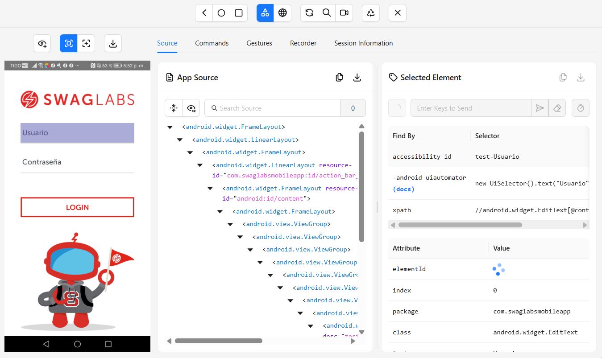
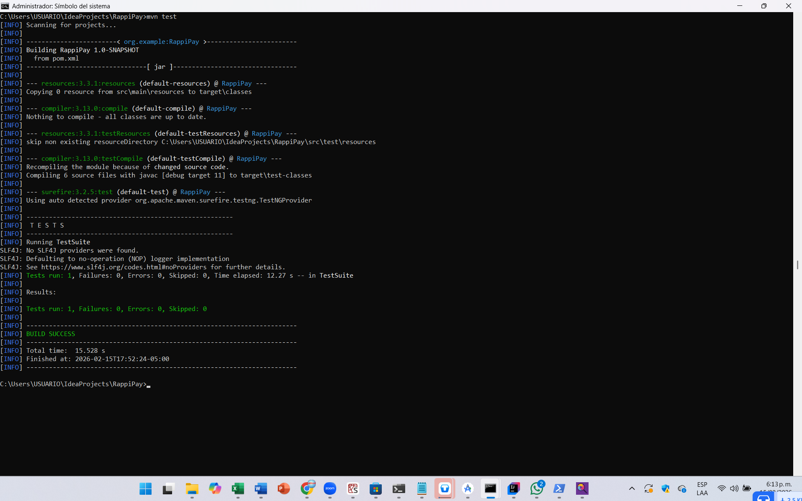
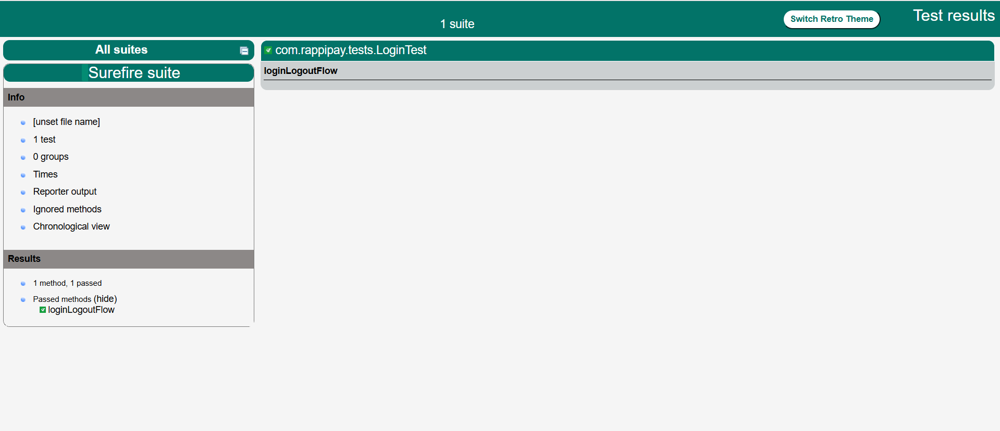

RappiPay – Automatización con Appium

Descripción
Este proyecto implementa un flujo automatizado de pruebas sobre una aplicación móvil demo (Swag Labs), utilizando Appium y TestNG.
El flujo cubre:

Apertura de la aplicación.

Login con credenciales válidas.

Validación de la pantalla principal (home).

Logout (cerrar sesión).

Dependencias y versiones
Java: 11

Maven: 3.9.x

Appium Java Client: 8.5.1

Selenium: 4.13.0

TestNG: 7.x

Appium Server: 2.x (UiAutomator2 como automationName)

Arquitectura del proyecto
El proyecto sigue el patrón Page Object Model (POM) para mantener el código modular y escalable:

BaseTest.java → Configuración de Appium y driver.

LoginPage.java → Métodos para login.

HomePage.java → Métodos para logout.

LoginTest.java → Flujo de prueba automatizado.

Ejecución
Asegúrate de tener Appium Server corriendo en http://127.0.0.1:4723.

Conecta tu dispositivo/emulador Android con modo desarrollador activo.

Ejecuta las pruebas con Maven:
mvn clean test
Los resultados aparecerán en consola y en target/surefire-reports.

Decisiones de diseño
Se eligió TestNG por su flexibilidad en la gestión de suites y anotaciones.

Se aplicó Page Object Model para separar lógica de negocio de la lógica de prueba.

Se usó WebDriverWait para sincronización explícita y evitar fallos por tiempos de carga.

Los locators se obtuvieron directamente de Appium Inspector, adaptados a la versión en español de la app (test-Usuario, test-Contraseña, test-Menu, "CERRAR SESION").

Evidencias
Appium inspector

Ejecución exitosa

Reporte desde Target
